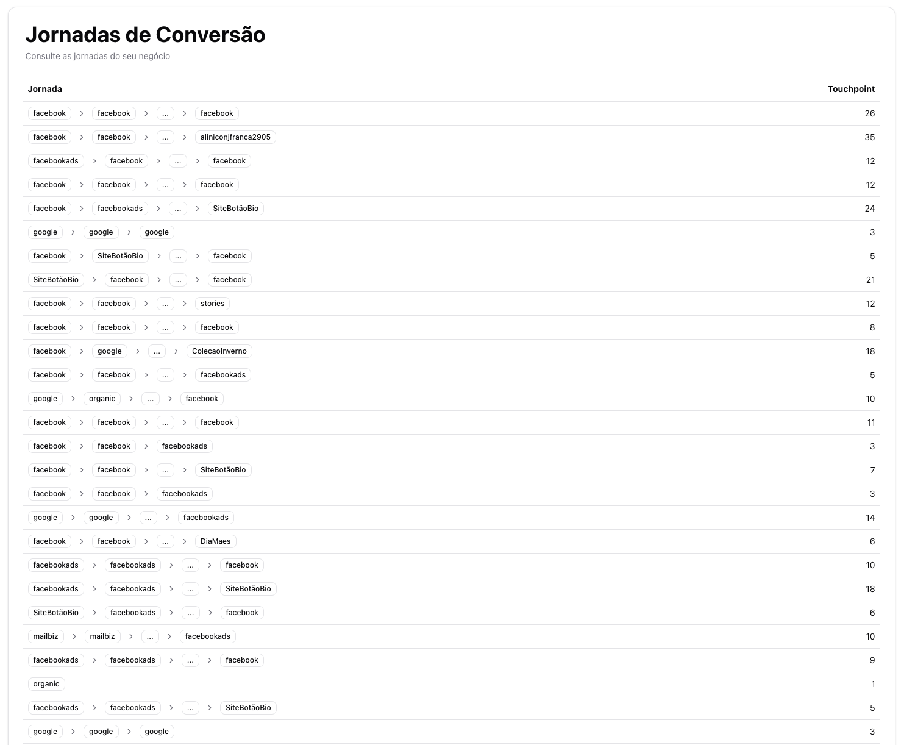

# Nemu Challenge Front-End

Este projeto é uma aplicação web desenvolvida em Next.js que consome os dados da API [desse projeto](https://github.com/birobirobiro/nemu-challenge-back-end) e permite visualizar os dados da jornada de conversão.

<p align="center">
  
</p>

## Tecnologias Utilizadas

- [Next.js](https://nextjs.org/)
- [React](https://react.dev/)
- [Tailwind CSS](https://tailwindcss.com/)
- [TypeScript](https://www.typescriptlang.org/)
- [shadcn/ui](https://ui.shadcn.com/)

## Como rodar localmente

1. Clone o repositório utilizando alguma das alternativas abaixo:

- HTTPS:

```bash
https://github.com/birobirobiro/nemu-challenge-front-end.git
```

- SSH:

```bash
git@github.com:birobirobiro/nemu-challenge-front-end.git
```

- GitHub CLI:

```bash
gh repo clone birobirobiro/nemu-challenge-front-end
```

2. Acesse a pasta do projeto:

```bash
cd nemu-challenge-front-end
```

2. Instale as dependências:

   ```bash
   npm install
   ```

3. Faça uma cópia do arquivo `.env.example` localizado na raíz do projeto e renomeie-o para `.env.local`

4. Inicie o servidor:

   ```bash
   npm run dev
   ```

5. Acesse o repositório [nemu-challenge-back-end](https://github.com/birobirobiro/nemu-challenge-back-end) e siga as instruções descritas no README para que a comunicação ocorra corretamente entre o front-end e back-end.
